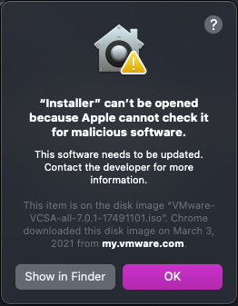

Last Friday, I wanted to upgrade my vCenter server with embedded platform (VCSA) from version 6.7 to 7.0. I downloaded the ISO and mounted that on my Mac. However, as soon as I clicked to launch the UI installer is when my Mac started to block it and not even letting me launch it. See the screenshot below:

I had to go to System Pereferences > Security & Privacy > General and manually click on "Open Anyway" to launch this installer because it was blocked from use as it is not from an identified developer according to Apple.

That allowed me to launch the installer, and then clicked on upgrade and provided the requested info and clicked on continue. This is where I got the next warning message about "ovftool" cannot be opened because its developer cannot be verified. 

The problem was that this time, it didn't even allow me to open the Security & Privacy and manually click open, it only allowed me to either cancel the process or Eject Disk Image.

After googling around for these errors, I came across this [KB article](https://kb.vmware.com/s/article/79416) on VMware's website. Basically, you need to disable the security of your Mac, and re-enable it once you are done with upgrade. Here are the steps:

1. Run the command: `sudo spctl --master-disable` in terminal.
2. In Security and Privacy settings set <strong>Allow apps download from</strong> to <strong>anywhere</strong>.
3. Run `sudo xattr -r -d com.apple.quarantine Path_to_the_iso`  
Example: 
`sudo xattr -r -d com.apple.quarantine VMware-VCSA-all-6.7.0-Update-15132721` 
`sudo xattr -r -d com.apple.quarantine VMware-VCSA-all-7.0.0-15952498.iso`
4. Mount the ISO and open UI Installer
5. Install/Upgrade vCenter Server 6.7/7.0
6. Execute `sudo spctl —master-enable` in terminal.

Once you've done this, you will be able to cruise through the upgrade process. It was a bit annoying to see this, but I am glad this workaround was available.

Hopefully, this can help some of you who come across the same situation.

Enjoy!
